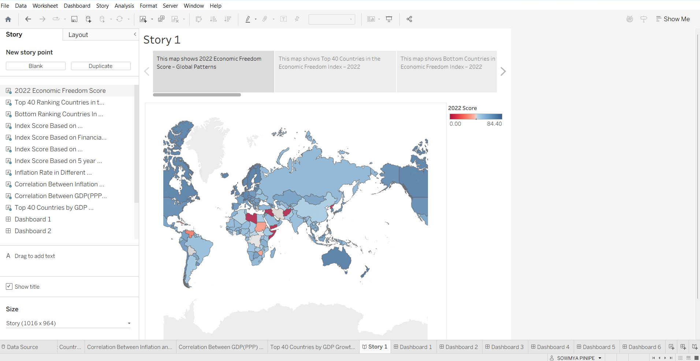

# 📊 Measuring the Pulse of Prosperity: An Index of Economic Freedom Analysis

## 📁 Category
**Data Analytics with Tableau**

## 🛠️ Skills Used
- Exploratory Data Analysis (EDA)
- Tableau (Dashboard, Story)
- MySQL / Databases
- Data Visualization
- Publishing to Tableau Public

---

## 📌 Introduction

Economic freedom is the fundamental right of every human to control their own labor and property. In an economically free society, individuals are free to work, produce, consume, and invest in any way they please. Governments allow labor, capital, and goods to move freely and refrain from coercion or constraint beyond what is necessary to maintain liberty itself.

This project is based on the **2022 Index of Economic Freedom**, an annual guide published by **The Heritage Foundation**. The dataset includes 12 factors grouped into four broad categories:

### Pillars of Economic Freedom:
1. **Rule of Law** – Property rights, Government integrity, Judicial effectiveness  
2. **Government Size** – Government spending, Tax burden, Fiscal health  
3. **Regulatory Efficiency** – Business freedom, Labor freedom, Monetary freedom  
4. **Open Markets** – Trade freedom, Investment freedom, Financial freedom  

---

## 🎯 Objectives

- Analyze and visualize the economic freedom indicators across different countries.
- Explore relationships between:
  - GDP (PPP)
  - Inflation
  - Unemployment
  - Monetary Freedom
- Identify patterns among high vs low freedom economies.
- Create an interactive and narrative-based Tableau Story to summarize insights.

---

## 📂 Project Structure
datasets/
index_of_economic_freedom.csv

tableau/
economic_freedom_dashboard.twbx

screenshots/
dashboard_view.png
storyboard_view.png

demo/
project_demo.mp4 (optional)

---

## 📊 Tableau Dashboards

### 🔗 Published Dashboards on Tableau Public
> *(Replace `#` with your actual links after publishing)*

- Story Board
- https://public.tableau.com/views/StoryBoard_17514753280580/Story1?:language=en-US&publish=yes&:sid=&:redirect=auth&:display_count=n&:origin=viz_share_link
- DashBoard
- https://public.tableau.com/views/Dashboard_17514752674210/Dashboard1?:language=en-US&:sid=&:redirect=auth&:display_count=n&:origin=viz_share_link

---

## 🖼️ Screenshots

### Dashboard Sample:

### Storyboard Sample:

---

## 🚀 How to Run the Project

1. Clone this repository or download the ZIP.
2. Open the `.twbx` file using Tableau Desktop.
3. Use filters to explore:
   - Regions
   - Economic Freedom categories
   - Comparison across countries
4. Optionally connect the dataset to MySQL for extended database exploration.

---

## 📈 Key Insights

- Countries with **higher monetary freedom** typically report **stronger GDP (PPP)**.
- **Low inflation** often correlates with higher economic freedom scores.
- Top economic performers have better **regulatory efficiency** and **open market freedom**.
- Nations with **low economic freedom** also show higher government spending and fiscal burdens.

---

## 🎥 Project Demonstration (Optional)
> *(Upload your demo video to the `demo/` folder or YouTube and link it here)*

- [Watch Demo on YouTube](#)

---

## 🧾 License

This project is developed as part of a SmartInternz Guided Project. Dataset sourced from The Heritage Foundation's Index of Economic Freedom.

---

## 🙋‍♀️ Author

**Sowmya Pinipe**  
SmartInternz Student  
JNTUK Guided Project 2025  

